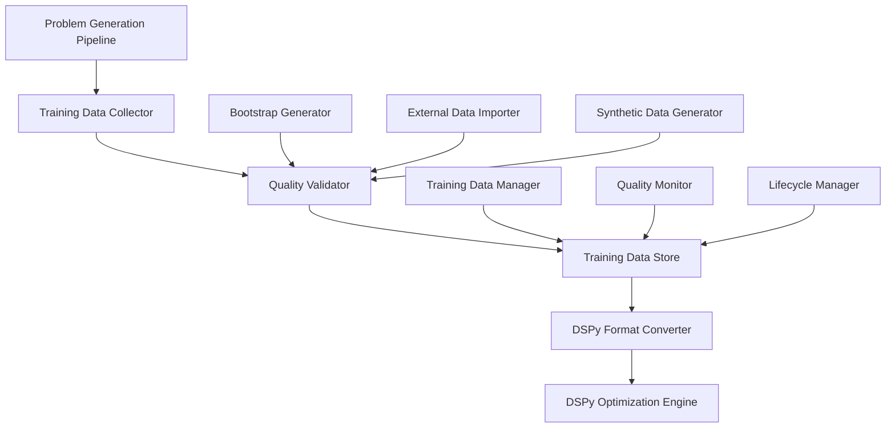

# DSPy Training Data Generation System - Design

## Overview

The DSPy Training Data Generation System provides multiple strategies for creating high-quality training data when none exists. The system integrates with the existing problem generation pipeline to automatically capture successful examples, bootstrap new datasets, and manage training data lifecycle.

## Architecture

### Core Components



### Data Flow

1. **Collection Phase**: Capture examples from multiple sources
2. **Validation Phase**: Quality assessment and filtering
3. **Storage Phase**: Structured storage with metadata
4. **Conversion Phase**: Transform to DSPy format
5. **Optimization Phase**: Use in DSPy training

## Components and Interfaces

### 1. Training Data Collector

```python
from dataclasses import dataclass
from typing import Dict, List, Any, Optional
from enum import Enum

class CollectionMode(Enum):
    AUTOMATIC = "automatic"
    MANUAL = "manual"
    BOOTSTRAP = "bootstrap"

@dataclass
class TrainingExample:
    """Raw training example before DSPy conversion."""
    
    # Input parameters
    subject: str
    topic: str
    difficulty_level: Optional[str]
    seed_prompt: Optional[str]
    
    # Generated outputs
    problem: str
    answer: str
    hints: Dict[str, str]
    solution: Optional[str]
    
    # Quality metrics
    quality_score: float
    checker_score: float
    target_model_failed: bool
    
    # Metadata
    timestamp: str
    generation_config: Dict[str, Any]
    domain: str
    
    def to_dict(self) -> Dict[str, Any]:
        """Convert to dictionary for storage."""
        return {
            "inputs": {
                "subject": self.subject,
                "topic": self.topic,
                "difficulty_level": self.difficulty_level,
                "seed_prompt": self.seed_prompt
            },
            "outputs": {
                "problem": self.problem,
                "answer": self.answer,
                "hints": self.hints,
                "solution": self.solution
            },
            "quality": {
                "quality_score": self.quality_score,
                "checker_score": self.checker_score,
                "target_model_failed": self.target_model_failed
            },
            "metadata": {
                "timestamp": self.timestamp,
                "generation_config": self.generation_config,
                "domain": self.domain
            }
        }

class TrainingDataCollector:
    """Collects training examples from problem generation pipeline."""
    
    def __init__(self, config: Dict[str, Any]):
        self.config = config
        self.collection_mode = CollectionMode(config.get("collection_mode", "automatic"))
        self.min_quality_score = config.get("min_quality_score", 0.7)
        self.storage = TrainingDataStore(config.get("storage_config", {}))
        
    def collect_from_generation(self, generation_result: Dict[str, Any]) -> Optional[TrainingExample]:
        """Collect training example from successful problem generation."""
        
        # Only collect if quality meets threshold
        if generation_result.get("quality_score", 0) < self.min_quality_score:
            return None
            
        # Only collect if target model failed (indicates good problem)
        if not generation_result.get("target_model_failed", False):
            return None
            
        example = TrainingExample(
            subject=generation_result["subject"],
            topic=generation_result["topic"],
            difficulty_level=generation_result.get("difficulty_level"),
            seed_prompt=generation_result.get("seed_prompt"),
            problem=generation_result["problem"],
            answer=generation_result["answer"],
            hints=generation_result["hints"],
            solution=generation_result.get("solution"),
            quality_score=generation_result["quality_score"],
            checker_score=generation_result.get("checker_score", 0.0),
            target_model_failed=generation_result["target_model_failed"],
            timestamp=generation_result["timestamp"],
            generation_config=generation_result.get("config", {}),
            domain=self._classify_domain(generation_result["subject"])
        )
        
        # Store the example
        self.storage.store_example(example)
        return example
        
    def _classify_domain(self, subject: str) -> str:
        """Classify subject into STREAM domain."""
        math_subjects = ["algebra", "calculus", "geometry", "statistics", "number theory"]
        if any(math_sub in subject.lower() for math_sub in math_subjects):
            return "mathematics"
        return "mathematics"  # Default for now
```

### 2. Bootstrap Generator

```python
class BootstrapGenerator:
    """Generates initial training data by running problem generation."""
    
    def __init__(self, config: Dict[str, Any]):
        self.config = config
        self.target_examples_per_domain = config.get("target_examples_per_domain", 20)
        self.max_attempts_per_example = config.get("max_attempts_per_example", 5)
        
    async def bootstrap_domain(self, domain: str) -> List[TrainingExample]:
        """Bootstrap training data for a specific domain."""
        
        examples = []
        domain_config = self.config.get("domains", {}).get(domain, {})
        
        # Get topics for this domain
        topics = self._get_domain_topics(domain)
        
        for topic in topics:
            topic_examples = await self._generate_topic_examples(domain, topic)
            examples.extend(topic_examples)
            
            if len(examples) >= self.target_examples_per_domain:
                break
                
        return examples[:self.target_examples_per_domain]
        
    async def _generate_topic_examples(self, domain: str, topic: str) -> List[TrainingExample]:
        """Generate examples for a specific topic."""
        
        examples = []
        difficulty_levels = ["easy", "medium", "hard"]
        
        for difficulty in difficulty_levels:
            for attempt in range(self.max_attempts_per_example):
                try:
                    # Use existing problem generation pipeline
                    from core.orchestration.generate_batch import _generate_and_validate_prompt
                    
                    config = self._build_generation_config(domain, topic, difficulty)
                    result_type, data = _generate_and_validate_prompt(config, CostTracker())
                    
                    if result_type == "accepted":
                        example = self._convert_to_training_example(data, domain, topic, difficulty)
                        examples.append(example)
                        break  # Success, move to next difficulty
                        
                except Exception as e:
                    logger.warning("Bootstrap generation failed for %s/%s/%s: %s", 
                                 domain, topic, difficulty, str(e))
                    continue
                    
        return examples
        
    def _build_generation_config(self, domain: str, topic: str, difficulty: str) -> Dict[str, Any]:
        """Build configuration for problem generation."""
        
        base_config = self.config.get("generation_config", {})
        return {
            **base_config,
            "subject": topic,
            "topic": topic,
            "difficulty_level": difficulty,
            "domain": domain,
            "bootstrap_mode": True
        }
```

### 3. Training Data Store

```python
import json
import sqlite3
from pathlib import Path
from typing import List, Dict, Any, Optional

class TrainingDataStore:
    """Manages storage and retrieval of training examples."""
    
    def __init__(self, config: Dict[str, Any]):
        self.config = config
        self.db_path = Path(config.get("db_path", ".cache/training_data/examples.db"))
        self.db_path.parent.mkdir(parents=True, exist_ok=True)
        self._init_database()
        
    def _init_database(self):
        """Initialize SQLite database for training examples."""
        
        with sqlite3.connect(self.db_path) as conn:
            conn.execute("""
                CREATE TABLE IF NOT EXISTS training_examples (
                    id INTEGER PRIMARY KEY AUTOINCREMENT,
                    domain TEXT NOT NULL,
                    subject TEXT NOT NULL,
                    topic TEXT NOT NULL,
                    difficulty_level TEXT,
                    quality_score REAL NOT NULL,
                    checker_score REAL,
                    target_model_failed BOOLEAN,
                    timestamp TEXT NOT NULL,
                    inputs TEXT NOT NULL,  -- JSON
                    outputs TEXT NOT NULL, -- JSON
                    metadata TEXT,         -- JSON
                    created_at DATETIME DEFAULT CURRENT_TIMESTAMP,
                    updated_at DATETIME DEFAULT CURRENT_TIMESTAMP
                )
            """)
            
            conn.execute("""
                CREATE INDEX IF NOT EXISTS idx_domain_quality 
                ON training_examples(domain, quality_score DESC)
            """)
            
            conn.execute("""
                CREATE INDEX IF NOT EXISTS idx_topic_difficulty 
                ON training_examples(topic, difficulty_level)
            """)
            
    def store_example(self, example: TrainingExample) -> int:
        """Store a training example and return its ID."""
        
        with sqlite3.connect(self.db_path) as conn:
            cursor = conn.execute("""
                INSERT INTO training_examples (
                    domain, subject, topic, difficulty_level,
                    quality_score, checker_score, target_model_failed,
                    timestamp, inputs, outputs, metadata
                ) VALUES (?, ?, ?, ?, ?, ?, ?, ?, ?, ?, ?)
            """, (
                example.domain,
                example.subject,
                example.topic,
                example.difficulty_level,
                example.quality_score,
                example.checker_score,
                example.target_model_failed,
                example.timestamp,
                json.dumps(example.to_dict()["inputs"]),
                json.dumps(example.to_dict()["outputs"]),
                json.dumps(example.to_dict()["metadata"])
            ))
            
            return cursor.lastrowid
            
    def get_examples_for_domain(self, domain: str, limit: Optional[int] = None) -> List[TrainingExample]:
        """Retrieve training examples for a domain."""
        
        query = """
            SELECT * FROM training_examples 
            WHERE domain = ? 
            ORDER BY quality_score DESC, created_at DESC
        """
        
        if limit:
            query += f" LIMIT {limit}"
            
        with sqlite3.connect(self.db_path) as conn:
            conn.row_factory = sqlite3.Row
            rows = conn.execute(query, (domain,)).fetchall()
            
        return [self._row_to_example(row) for row in rows]
        
    def get_domain_statistics(self, domain: str) -> Dict[str, Any]:
        """Get statistics for a domain's training data."""
        
        with sqlite3.connect(self.db_path) as conn:
            stats = {}
            
            # Total count
            stats["total_examples"] = conn.execute(
                "SELECT COUNT(*) FROM training_examples WHERE domain = ?", 
                (domain,)
            ).fetchone()[0]
            
            # Quality distribution
            stats["avg_quality"] = conn.execute(
                "SELECT AVG(quality_score) FROM training_examples WHERE domain = ?", 
                (domain,)
            ).fetchone()[0] or 0.0
            
            # Topic distribution
            topic_counts = conn.execute("""
                SELECT topic, COUNT(*) as count 
                FROM training_examples 
                WHERE domain = ? 
                GROUP BY topic 
                ORDER BY count DESC
            """, (domain,)).fetchall()
            
            stats["topic_distribution"] = {row[0]: row[1] for row in topic_counts}
            
            # Difficulty distribution
            difficulty_counts = conn.execute("""
                SELECT difficulty_level, COUNT(*) as count 
                FROM training_examples 
                WHERE domain = ? AND difficulty_level IS NOT NULL
                GROUP BY difficulty_level
            """, (domain,)).fetchall()
            
            stats["difficulty_distribution"] = {row[0]: row[1] for row in difficulty_counts}
            
        return stats
        
    def _row_to_example(self, row: sqlite3.Row) -> TrainingExample:
        """Convert database row to TrainingExample."""
        
        inputs = json.loads(row["inputs"])
        outputs = json.loads(row["outputs"])
        metadata = json.loads(row["metadata"]) if row["metadata"] else {}
        
        return TrainingExample(
            subject=inputs["subject"],
            topic=inputs["topic"],
            difficulty_level=inputs.get("difficulty_level"),
            seed_prompt=inputs.get("seed_prompt"),
            problem=outputs["problem"],
            answer=outputs["answer"],
            hints=outputs["hints"],
            solution=outputs.get("solution"),
            quality_score=row["quality_score"],
            checker_score=row["checker_score"] or 0.0,
            target_model_failed=bool(row["target_model_failed"]),
            timestamp=row["timestamp"],
            generation_config=metadata.get("generation_config", {}),
            domain=row["domain"]
        )
```

### 4. DSPy Format Converter

```python
class DSPyFormatConverter:
    """Converts training examples to DSPy format."""
    
    def __init__(self, config: Dict[str, Any]):
        self.config = config
        
    def convert_examples(self, examples: List[TrainingExample]) -> List[Any]:
        """Convert training examples to DSPy format."""
        
        dspy_examples = []
        
        for example in examples:
            try:
                dspy_example = self._convert_single_example(example)
                if dspy_example:
                    dspy_examples.append(dspy_example)
            except Exception as e:
                logger.warning("Failed to convert example: %s", str(e))
                continue
                
        return dspy_examples
        
    def _convert_single_example(self, example: TrainingExample) -> Optional[Any]:
        """Convert a single training example to DSPy format."""
        
        # Create DSPy example with inputs and expected outputs
        try:
            # This would use actual DSPy Example class in real implementation
            dspy_example = type('DSPyExample', (), {
                'subject': example.subject,
                'topic': example.topic,
                'difficulty_level': example.difficulty_level or "medium",
                'seed_prompt': example.seed_prompt or "",
                'problem': example.problem,
                'answer': example.answer,
                'hints': example.hints,
                'solution': example.solution or "",
                'quality_score': example.quality_score
            })()
            
            return dspy_example
            
        except Exception as e:
            logger.error("DSPy conversion failed for example: %s", str(e))
            return None
```

### 5. Training Data Manager

```python
class TrainingDataManager:
    """High-level manager for training data operations."""
    
    def __init__(self, config: Dict[str, Any]):
        self.config = config
        self.collector = TrainingDataCollector(config.get("collector", {}))
        self.bootstrap = BootstrapGenerator(config.get("bootstrap", {}))
        self.store = TrainingDataStore(config.get("storage", {}))
        self.converter = DSPyFormatConverter(config.get("converter", {}))
        
    async def ensure_training_data(self, domain: str, min_examples: int = 10) -> bool:
        """Ensure sufficient training data exists for a domain."""
        
        # Check current data
        current_examples = self.store.get_examples_for_domain(domain)
        
        if len(current_examples) >= min_examples:
            logger.info("Domain %s has sufficient training data (%d examples)", 
                       domain, len(current_examples))
            return True
            
        # Need to generate more data
        needed = min_examples - len(current_examples)
        logger.info("Domain %s needs %d more training examples", domain, needed)
        
        # Bootstrap additional examples
        new_examples = await self.bootstrap.bootstrap_domain(domain)
        
        # Store new examples
        for example in new_examples:
            self.store.store_example(example)
            
        total_examples = len(current_examples) + len(new_examples)
        
        if total_examples >= min_examples:
            logger.info("Successfully generated training data for domain %s (%d examples)", 
                       domain, total_examples)
            return True
        else:
            logger.warning("Could not generate sufficient training data for domain %s (%d/%d)", 
                          domain, total_examples, min_examples)
            return False
            
    def get_dspy_training_data(self, domain: str) -> List[Any]:
        """Get training data in DSPy format for a domain."""
        
        examples = self.store.get_examples_for_domain(domain)
        return self.converter.convert_examples(examples)
        
    def get_domain_readiness(self, domain: str) -> Dict[str, Any]:
        """Check if domain is ready for DSPy optimization."""
        
        stats = self.store.get_domain_statistics(domain)
        min_examples = self.config.get("min_examples_per_domain", 10)
        
        return {
            "domain": domain,
            "ready": stats["total_examples"] >= min_examples,
            "current_examples": stats["total_examples"],
            "required_examples": min_examples,
            "avg_quality": stats["avg_quality"],
            "topic_coverage": len(stats["topic_distribution"]),
            "recommendations": self._get_recommendations(stats, min_examples)
        }
        
    def _get_recommendations(self, stats: Dict[str, Any], min_examples: int) -> List[str]:
        """Generate recommendations for improving training data."""
        
        recommendations = []
        
        if stats["total_examples"] < min_examples:
            recommendations.append(f"Generate {min_examples - stats['total_examples']} more examples")
            
        if stats["avg_quality"] < 0.8:
            recommendations.append("Improve example quality (current avg: {:.2f})".format(stats["avg_quality"]))
            
        if len(stats["topic_distribution"]) < 3:
            recommendations.append("Add more topic diversity")
            
        return recommendations
```

## Data Models

### Training Example Schema

```json
{
  "id": "unique_identifier",
  "domain": "mathematics",
  "inputs": {
    "subject": "calculus",
    "topic": "derivatives",
    "difficulty_level": "medium",
    "seed_prompt": "optimization problem"
  },
  "outputs": {
    "problem": "Find the maximum value of f(x) = x^2 - 4x + 3",
    "answer": "The maximum value is -1 at x = 2",
    "hints": {
      "0": "Complete the square",
      "1": "Find the vertex of the parabola"
    },
    "solution": "f(x) = (x-2)^2 - 1, so minimum is -1"
  },
  "quality": {
    "quality_score": 0.85,
    "checker_score": 0.9,
    "target_model_failed": true
  },
  "metadata": {
    "timestamp": "2025-08-05T17:00:00Z",
    "generation_config": {...},
    "created_at": "2025-08-05T17:00:00Z"
  }
}
```

## Error Handling

### Training Data Collection Errors

```python
class TrainingDataError(Exception):
    """Base exception for training data operations."""
    pass

class InsufficientDataError(TrainingDataError):
    """Raised when not enough training data is available."""
    pass

class QualityThresholdError(TrainingDataError):
    """Raised when examples don't meet quality requirements."""
    pass

class ConversionError(TrainingDataError):
    """Raised when DSPy format conversion fails."""
    pass
```

### Error Recovery Strategies

1. **Bootstrap Failure**: Retry with relaxed quality thresholds
2. **Storage Failure**: Use fallback file-based storage
3. **Conversion Failure**: Skip problematic examples and continue
4. **Quality Issues**: Generate additional examples automatically

## Testing Strategy

### Unit Tests

- TrainingExample creation and validation
- Database operations (store, retrieve, query)
- DSPy format conversion
- Quality scoring and filtering

### Integration Tests

- End-to-end bootstrap process
- Integration with problem generation pipeline
- DSPy optimization with generated training data
- Performance under load

### Performance Tests

- Training data collection speed
- Database query performance
- Memory usage during bootstrap
- DSPy optimization time with different dataset sizes

## Configuration

### Training Data Configuration

```yaml
training_data:
  collection_mode: "automatic"  # automatic, manual, bootstrap
  min_quality_score: 0.7
  min_examples_per_domain: 10
  max_examples_per_domain: 100
  
  storage:
    db_path: ".cache/training_data/examples.db"
    backup_enabled: true
    cleanup_after_days: 30
    
  bootstrap:
    target_examples_per_domain: 20
    max_attempts_per_example: 5
    difficulty_levels: ["easy", "medium", "hard"]
    
  quality:
    auto_validation: true
    manual_review_threshold: 0.9
    reject_below_score: 0.5
    
  dspy_integration:
    auto_enable_threshold: 10
    reoptimize_on_new_data: true
    validation_split: 0.2
```

This design provides a comprehensive solution for generating training data when none exists, enabling DSPy optimization through multiple strategies including automatic collection, bootstrapping, and synthetic generation.