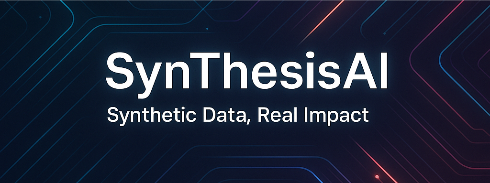

# SynThesisAI – Next-Generation Platform for Generative Intelligence Across STREAM

[](https://www.python.org/downloads/)
[](https://fastapi.tiangolo.com/)
[](https://github.com/stanfordnlp/dspy)
[](https://opensource.org/licenses/MIT)



## Overview

SynThesisAI is a comprehensive, self-optimizing, multi-domain AI platform that leverages DSPy's declarative programming paradigm and agentic reinforcement learning to generate high-quality educational content across **STREAM** domains (Science, Technology, Reading, Engineering, Arts, and Mathematics).

### Key Features

- 🤖 **Multi-Agent RL Coordination**: Generator, Validator, and Curriculum agents working in harmony
- 🔧 **DSPy Integration**: Automated prompt optimization using MIPROv2 optimizer
- 🎯 **Domain Classification**: Intelligent routing across STREAM domains
- ✅ **Quality Assurance**: Multi-dimensional content validation framework
- 📈 **Performance Optimization**: Targeting 50-70% reduction in development time
- 🚀 **High Throughput**: 200-400% increase in content generation speed

## Attribution

This project is built upon the excellent foundation provided by [`kamaal505/synthetic_math_prompts_agent`](https://github.com/kamaal505/synthetic_math_prompts_agent). Special thanks to [Mirza Kamaal](https://github.com/kamaal505) and [Mintesnote Bankisara](https://github.com/MintesnoteBanksira), who, alongside myself, were the original innovators of this groundbreaking work on the synthetic math prompt agent system.

## Architecture

```bash
SynThesisAI Platform
├── Domain Classification Layer    # Routes requests to STREAM domains
├── DSPy Optimization Layer       # Automates prompt engineering
├── Multi-Agent RL Coordination   # Coordinates Generator/Validator/Curriculum
├── Quality Assurance Framework   # Validates content quality
└── Reasoning Trace Generation    # Provides educational transparency
```

## Performance Targets

- **50-70%** reduction in development time through automated prompt optimization
- **200-400%** increase in throughput through parallel processing
- **60-80%** reduction in operational costs through intelligent resource management
- **>95%** accuracy in generated content validation
- **<3%** false positive rate in quality assessment

## Quick Start

### Prerequisites

- Python 3.11 or higher
- UV package manager (recommended) or pip

### Installation

1. **Clone the repository**

   ```bash
   git clone https://github.com/Mathews-Tom/SynThesisAI.git
   cd SynThesisAI
   ```

2. **Install dependencies using UV (recommended)**

   ```bash
   uv sync
   ```

   Or using pip:

   ```bash
   pip install -r requirements.txt
   ```

3. **Set up environment variables**

   ```bash
   cp .env.example .env
   # Edit .env with your configuration
   ```

### Running the Application

1. **Start the FastAPI server**

   ```bash
   uv run python -m app.main
   ```

   Or with uvicorn directly:

   ```bash
   uvicorn app.main:app --reload --host 0.0.0.0 --port 8000
   ```

2. **Access the API documentation**
   - Swagger UI: <http://localhost:8000/docs>
   - ReDoc: <http://localhost:8000/redoc>

## Usage Examples

### Generate Educational Content

```python
import requests

# Generate math content
response = requests.post("http://localhost:8000/generate", json={
    "domain": "mathematics",
    "topic": "algebra",
    "difficulty": "intermediate",
    "content_type": "problem_set"
})

content = response.json()
print(content["generated_content"])
```

### Validate Content Quality

```python
# Validate generated content
response = requests.post("http://localhost:8000/validate", json={
    "content": "Your educational content here",
    "domain": "mathematics",
    "quality_metrics": ["accuracy", "clarity", "pedagogical_value"]
})

validation_result = response.json()
print(f"Quality Score: {validation_result['overall_score']}")
```

## Development

### Running Tests

```bash
# Run all tests
uv run pytest

# Run with coverage
uv run pytest --cov=app --cov-report=html

# Run specific test file
uv run pytest tests/test_core.py -v
```

### Code Quality

```bash
# Format code
uv run black .
uv run isort .

# Lint code
uv run flake8 .
uv run mypy .
```

## API Documentation

### Core Endpoints

- `POST /generate` - Generate educational content
- `POST /validate` - Validate content quality
- `GET /domains` - List available STREAM domains
- `GET /health` - Health check endpoint

### Authentication

The API uses JWT tokens for authentication. Include the token in the Authorization header:

```bash
curl -H "Authorization: Bearer YOUR_JWT_TOKEN" \
     -X POST http://localhost:8000/generate \
     -d '{"domain": "science", "topic": "physics"}'
```

## Configuration

Key configuration options in `config/settings.py`:

- `MODEL_CONFIG`: DSPy model settings
- `AGENT_CONFIG`: Multi-agent RL parameters
- `QUALITY_THRESHOLDS`: Content validation thresholds
- `PERFORMANCE_LIMITS`: Rate limiting and resource management

## Contributing

We welcome contributions! Please see our [Contributing Guidelines](CONTRIBUTING.md) for details.

1. Fork the repository
2. Create a feature branch (`git checkout -b feature/amazing-feature`)
3. Commit your changes (`git commit -m 'Add amazing feature'`)
4. Push to the branch (`git push origin feature/amazing-feature`)
5. Open a Pull Request

## License

This project is licensed under the MIT License - see the [LICENSE](LICENSE) file for details.

## Support

- 📧 Email: <support@synthesisai.com>
- 💬 Discord: [SynThesisAI Community](https://discord.gg/synthesisai)
- 📖 Documentation: [docs.synthesisai.com](https://docs.synthesisai.com)
- 🐛 Issues: [GitHub Issues](https://github.com/Mathews-Tom/SynThesisAI/issues)

## Roadmap

- [ ] Integration with additional LLM providers
- [ ] Real-time collaborative content generation
- [ ] Advanced analytics dashboard
- [ ] Mobile application support
- [ ] Multi-language content generation

---

**Built with ❤️ by the SynThesisAI Team**
